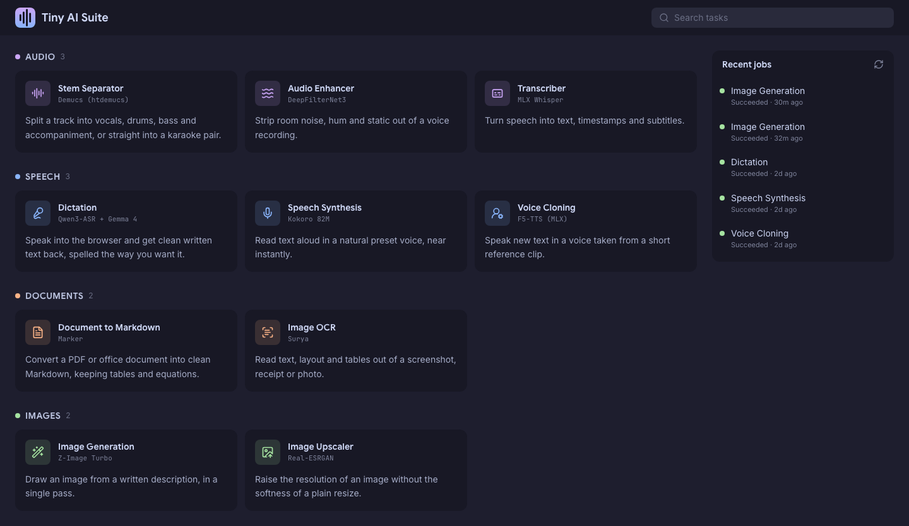
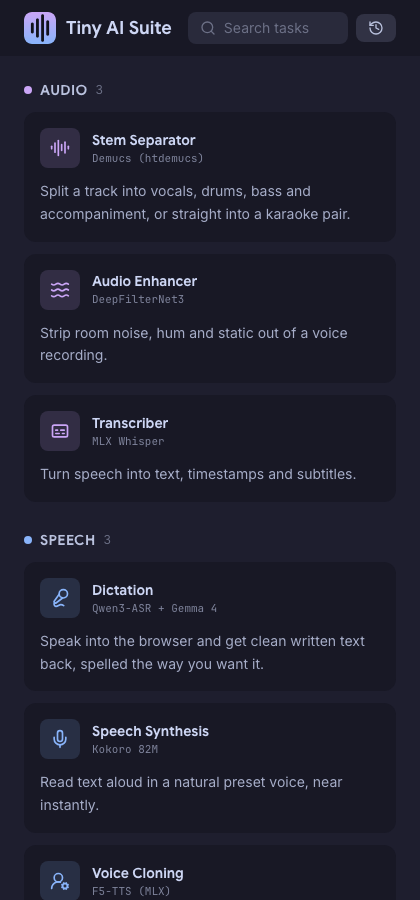
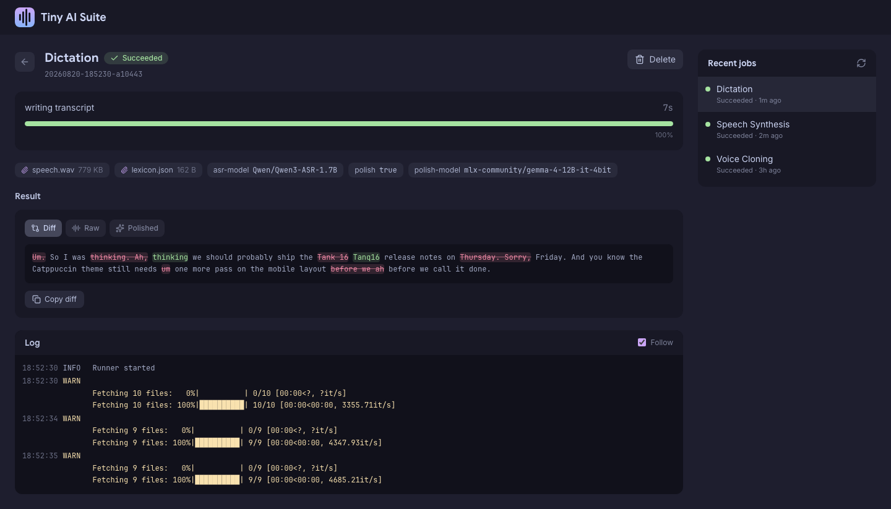
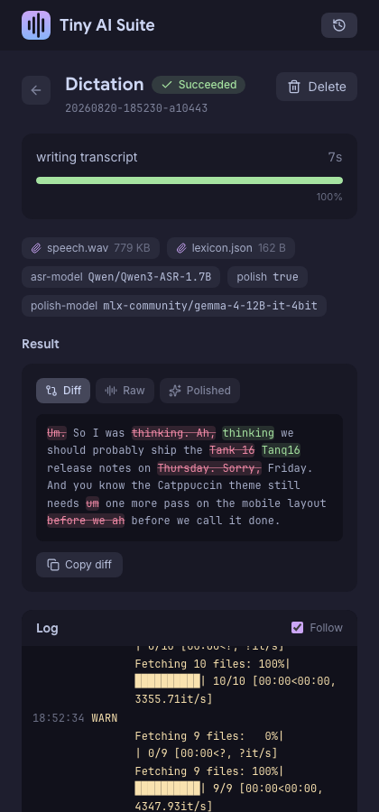

<div align="center">
  
  <h1>Tiny AI Suite</h1>

  <a href="#capabilities">Capabilities</a> &bull; <a href="#install">Install</a> &bull; <a href="#usage">Usage</a> &bull; <a href="#notes">Notes</a>
</div>

---

Tiny AI Suite runs ten local AI models on Apple Silicon: stem separation, denoising, transcription, dictation, speech synthesis, voice cloning, document conversion, OCR, image generation and image upscaling. Each one is a self-contained uv project under `ai-scripts/`, and one Go binary serves a web app that runs them and streams their progress back.

It exists because a Mac with unified memory outruns a free Colab T4 and never disconnects mid-job. Nothing leaves the machine, and there is no account, no queue and no API key.

## Capabilities

| Task | Engine | Runs on | Output |
|---|---|---|---|
| Stem Separator | Demucs `htdemucs` | Metal (torch MPS) | vocals, drums, bass, other, or a karaoke pair, plus a zip |
| Audio Enhancer | DeepFilterNet3 | Metal or CPU | denoised wav, original kept for A/B |
| Transcriber | MLX Whisper | Metal (MLX) | timestamped text, SRT, JSON segments |
| Dictation | Qwen3-ASR + Gemma 4 12B | Metal (MLX) | clean written text from a browser recording, spelled your way |
| Speech Synthesis | Kokoro 82M | Metal (MLX) | wav or mp3 from 9 preset voices |
| Voice Cloning | F5-TTS | Metal (MLX) | wav in a voice taken from a 5 to 15 second clip, recorded in the browser or uploaded |
| Document to Markdown | Marker | Metal (torch MPS) | Markdown, HTML or JSON, with tables, LaTeX and extracted images |
| Image OCR | Surya | Metal (torch MPS) | reading-order text, tables as Markdown and CSV, annotated preview |
| Image Generation | Z-Image Turbo, FLUX.2 Klein, Qwen-Image | Metal (MLX) | one png from a written prompt, on a seed you can hold and reuse |
| Image Upscaler | Real-ESRGAN via spandrel | Metal (torch MPS) | upscaled png with the original alongside |

Every task is reachable three ways: the web UI, the HTTP API, and the script on its own from a terminal.

## Screenshots

<details>
<summary>Click to expand</summary>

### Launcher

| Desktop | Mobile |
| :---: | :---: |
|  |  |

### Job

| Desktop | Mobile |
| :---: | :---: |
|  |  |

</details>

## Install

Apple Silicon only. Needs Go 1.26+, [uv](https://docs.astral.sh/uv/), and ffmpeg.

```bash
git clone https://github.com/Tanq16/tiny-ai && cd tiny-ai
make build
./tiny-ai-suite serve
```

`make build` downloads the pinned frontend assets and embeds them in the binary. Open `http://127.0.0.1:7777`.

Each task installs its own dependencies on first use, which takes a minute or two and downloads model weights on top. To get that over with up front:

```bash
make py-sync   # every task environment, roughly 8 GB on disk
make voices    # the three built-in voice cloning reference clips
```

`make voices` is required before the Voice Cloning presets work; without it that task falls back to needing your own reference clip.

## Usage

Every task takes `--outdir`, `--json`, `--quiet` and `--device` on top of its own flags, and prints artifact paths on stdout. `--json` switches it to the NDJSON event stream the server consumes.

```bash
uv run --project ai-scripts/transcribe transcribe --input talk.opus --outdir out
uv run --project ai-scripts/dictate dictate --input note.m4a --lexicon data/lexicon.json --outdir out
uv run --project ai-scripts/stems stems --input song.mp3 --two-stems --format mp3 --outdir out
uv run --project ai-scripts/tts tts --text "Ready when you are." --voice bf_emma --outdir out
uv run --project ai-scripts/imagegen imagegen --prompt "a red fox in fresh snow" --seed 42 --outdir out
cd ai-scripts/doc2md && uv run doc2md --input paper.pdf --pages 1-10 --outdir out
```

### Layout

```
ai-scripts/
├── common/       tinyai-common: the event protocol every task speaks
├── stems/        pyproject.toml, uv.lock, src/stems/
├── denoise/      ...
└── upscale/
```

Each task is its own uv project with its own lockfile and virtualenv, sharing only `common` as an editable path dependency. That isolation is not cosmetic: Demucs and Marker resolve to incompatible torch and numpy lines, so a single environment for all ten does not exist. Adding a task is `uv init --package --no-workspace ai-scripts/<name>`, then `uv add --editable ../common`.

### Server flags

| Flag | Default | Description |
|---|---|---|
| `--host` | `127.0.0.1` | Bind address |
| `--port` | `7777` | Port |
| `--data` | `./data` | Where uploads, outputs and job history live |
| `--scripts` | `./ai-scripts` | Directory holding the task projects |
| `--jobs` | `1` | Concurrent jobs |

### API

```bash
curl -X POST localhost:7777/api/jobs -F task=tts -F text="Hello" -F voice=af_heart
curl -N localhost:7777/api/jobs/<id>/events    # SSE progress
curl -O localhost:7777/api/jobs/<id>/artifacts/speech.wav
```

`GET /api/tasks` returns the catalog the UI renders its forms from, so a client can discover every task and parameter without hardcoding them. `GET` and `PUT /api/lexicon` read and replace the dictation vocabulary, which the browser attaches to each dictation job.

## Notes

- **One job at a time by default.** All ten tasks contend for the same unified memory, so `--jobs 1` avoids an out-of-memory failure halfway through a long run. Raise it if you know the two tasks fit.
- **Dictation needs an HTTPS address.** Browsers only open the microphone in a secure context, so the recorder is dead on a plain `http://` LAN address. Put a TLS-terminating proxy in front, or use the task from the machine the server runs on.
- **Dictation is two passes.** Qwen3-ASR writes the transcript with the vocabulary biasing its decoder, then Gemma rewrites it into clean prose using the vocabulary and the correction list. The job page shows one pane with diff, raw and polished tabs, and copies whichever tab is open.
- **Loopback by default.** The server executes local scripts and has no authentication, so binding it to `0.0.0.0` hands anyone on the network a shell-adjacent surface.
- **Image models are ungated by choice.** Every option downloads without a HuggingFace account, which rules out FLUX.1-dev and Krea 2 despite their quality.
- **Image weights are large.** The default 4-bit Z-Image Turbo is a 6 GB download, the 8-bit variant 33 GB, and Qwen-Image 58 GB.
- **LoRAs are named, not uploaded.** A HuggingFace repo id or a local `.safetensors` path, several separated by commas, each optionally suffixed with `:0.5` to set its strength.
- **Voice cloning cuts a long reference.** F5-TTS conditions on the reference clip and the new speech as one sequence, so anything past 15 seconds is dropped and the transcript is taken from what remains. A longer clip left whole comes back as babble.
- **First run of a task is slow.** It resolves an environment and downloads weights. Later runs start in about a second.
- **Job history survives a restart.** State lives under `data/jobs/<id>/`; a job that was running when the server died is marked failed on reload, because its process is gone.
- **No Docker.** Metal is unreachable from a Linux container on macOS, which would drop every task to CPU.
- **Adding a task** is one entry in `internal/catalog/tasks.go` and one uv project whose entry point is named after it. The form, the API and the argv are generated from the catalog entry, and the event protocol is documented at the top of `ai-scripts/common/src/tinyai_common/__init__.py`.
